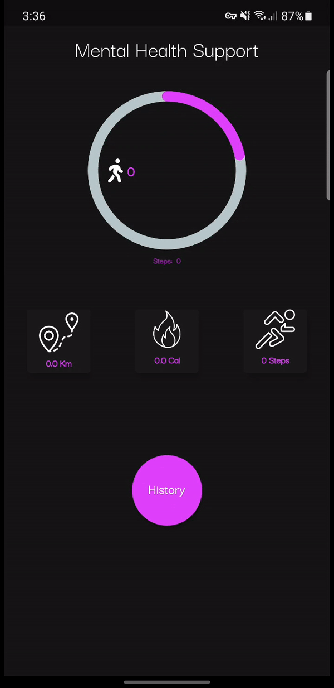

# FitnessApp

Complete With Step Tracking, Calorie and Distance Tracking & Sleep Tracking.
Added new Feature: Being able to record earliest sleeptime and latest wake up time.

# Fitness Tracker

 This is a fully functional Flutter app that demonstrates tracking daily steps alongside Calorie, Distance and Sleep tracking in Flutter.

<!--- Blog post: https://blog.maskys.com/implementing-a-daily-step-count-pedometer-in-flutter/ -->

 **Note:** To get this working on iOS, please do not forget to carry out the steps mentioned [here](https://github.com/cph-cachet/flutter-plugins/tree/master/packages/pedometer).

